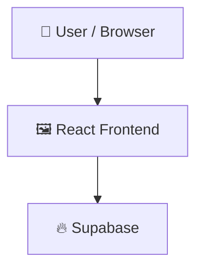

# GPA

## 📑 Table of Contents

- [Description](#description)
- [Tech Stack](#tech-stack)
- [Architecture](#architecture)
- [Quick Start](#quick-start)
- [Key Dependencies](#key-dependencies)
- [Available Scripts](#available-scripts)
- [Project Structure](#project-structure)
- [Development Setup](#development-setup)
- [Contributors](#contributors)
- [Contributing](#contributing)

## 📝 Description

The provided text is a raw archive output or compressed file dump representing the directory structure of a modern web development project. Based on the file names and configurations, it is a React application built with Vite, TypeScript, and Tailwind CSS.  

Core Project Components:
Template Origin: The .bolt/config.json file explicitly identifies the underlying architecture as the bolt-vite-react-ts template.  

Framework & Language: The src/ directory contains standard React entry points like App.tsx and main.tsx, alongside TypeScript configuration files (tsconfig.json, tsconfig.app.json, tsconfig.node.json).  

Build Tooling: The project utilizes Vite as its frontend bundler, evidenced by the vite.config.ts file.  

Styling: The presence of tailwind.config.js and postcss.config.js indicates that Tailwind CSS is being used for styling.  

Package Management & Linting: Standard Node.js environment files like package.json and package-lock.json handle dependencies, while eslint.config.js provides linting rules for code quality.

## 🛠️ Tech Stack

    

## 🏗️ Architecture

A high-level view of how the main pieces fit together:



## ⚡ Quick Start

```bash

# 1. Clone the repository
git clone https://github.com/KATYAL07/GPA.git

# 2. Install dependencies
npm install

# 3. Start the dev server
npm run dev
```

## 📦 Key Dependencies

```
@supabase/supabase-js: ^2.57.4
lucide-react: ^0.344.0
react: ^18.3.1
react-dom: ^18.3.1
```

## 🚀 Available Scripts

- **dev** — `npm run dev`
- **build** — `npm run build`
- **lint** — `npm run lint`
- **preview** — `npm run preview`
- **typecheck** — `npm run typecheck`

## 🛠️ Development Setup

### Node.js / JavaScript
1. Install Node.js (v18+ recommended)
2. Install dependencies: `npm install` (or `yarn` / `pnpm install` / `bun install`)
3. Start the dev server: see the **Quick Start** above

## 👥 Contributors

Thanks to everyone who has contributed to this project:

<p align="left">
<a href="https://github.com/KATYAL07" title="KATYAL07"></a>
</p>

[See the full list of contributors →](https://github.com/KATYAL07/GPA/graphs/contributors)
